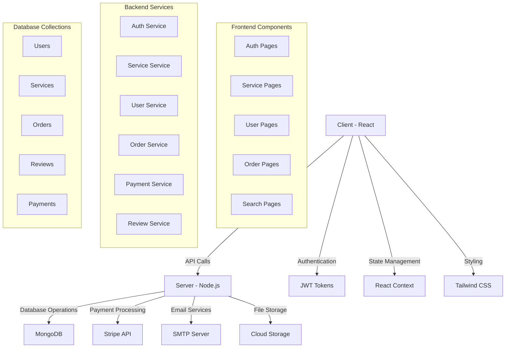
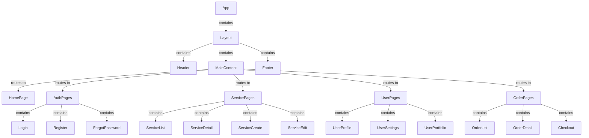
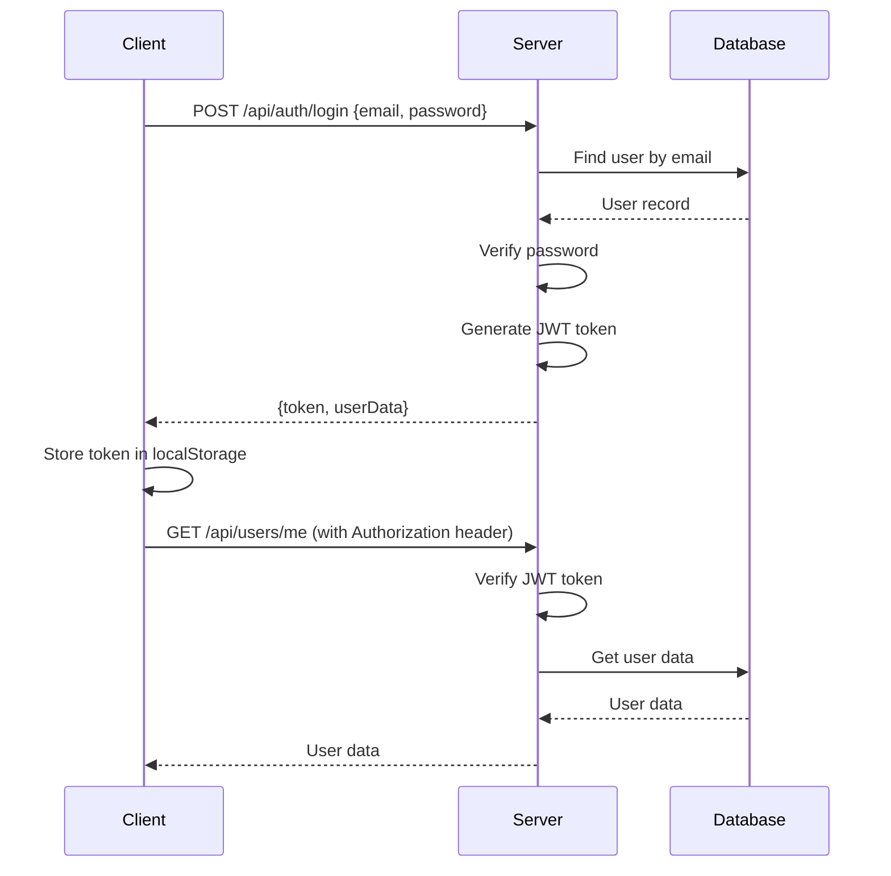
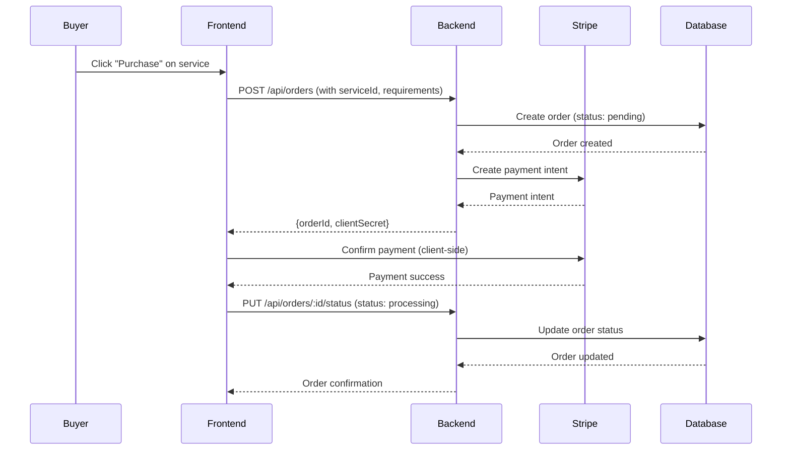
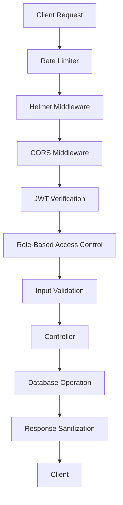
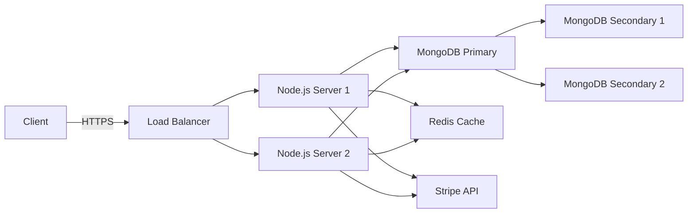

# Service Marketplace - System Architecture

## High-Level Architecture Diagram

## Component Architecture

### Frontend Component Tree

## Data Flow

### User Authentication Flow

### Service Purchase Flow

## Technical Implementation Details

### Frontend Layer

**State Management Strategy:**
- React Context for global state (auth, theme, user)
- React Query for server state (services, orders, reviews)
- Local component state for UI interactions

**Routing Strategy:**
- React Router v6 with lazy loading
- Protected routes for authenticated users
- Role-based route access control
- Dynamic route parameters for service/ID pages

### Backend Layer

**API Design Principles:**
- RESTful endpoints with consistent naming
- JWT authentication middleware
- Role-based access control
- Input validation and sanitization
- Rate limiting for public endpoints

**Error Handling:**
- Custom error classes
- Consistent error response format
- Error logging and monitoring
- User-friendly error messages

### Database Layer

**Data Modeling:**
- Mongoose schemas with validation
- Indexes for performance-critical queries
- Virtual properties for computed fields
- Pre/post hooks for data processing
- Population for related data

**Query Optimization:**
- Pagination for list endpoints
- Selective field projection
- Caching for frequent queries
- Aggregation pipelines for complex queries

## Security Architecture

## Performance Considerations

**Frontend:**
- Code splitting with React.lazy
- Image optimization and lazy loading
- Memoization with React.memo
- Virtualized lists for large datasets
- Service worker for offline caching

**Backend:**
- Database connection pooling
- Query optimization and indexing
- Response compression
- Caching strategies
- Load balancing readiness

## Deployment Architecture

## Next Steps for Implementation

1. **Project Setup**
   - Create React frontend structure
   - Set up Node.js backend structure
   - Configure build tools and dependencies
   - Set up environment variables

2. **Core Implementation**
   - Implement authentication system
   - Build service listing components
   - Create API endpoints
   - Set up database models

3. **Feature Development**
   - User profile management
   - Search and filtering
   - Payment integration
   - Review system

4. **Polishing**
   - Responsive design
   - Theme system
   - Performance optimization
   - Documentation